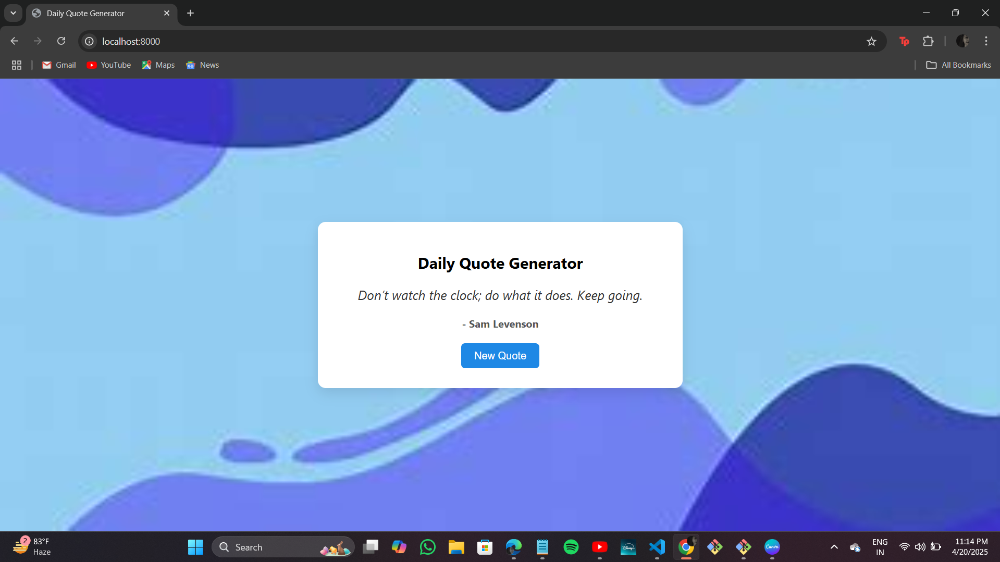

# 🌟 Daily Quote Generator

A simple and elegant web app that displays random inspirational quotes each time you click the "New Quote" button. Built using **HTML**, **CSS**, and **JavaScript** — perfect for motivation lovers and beginners learning web development!

---

## ✨ Features

- 🎯 Random quotes on every click  
- 🧠 Author name displayed with each quote  
- 🎨 Aesthetic background design  
- 💻 Responsive and minimal UI

---

## 📂 Project Structure

daily-quote-generator/
│
├── index.html          # Main HTML structure
├── style.css           # Styles and layout
├── script.js           # Quote logic and interaction
├── quotes.json         # List of quotes
└── images/
    └── background.jpg  # Background image

